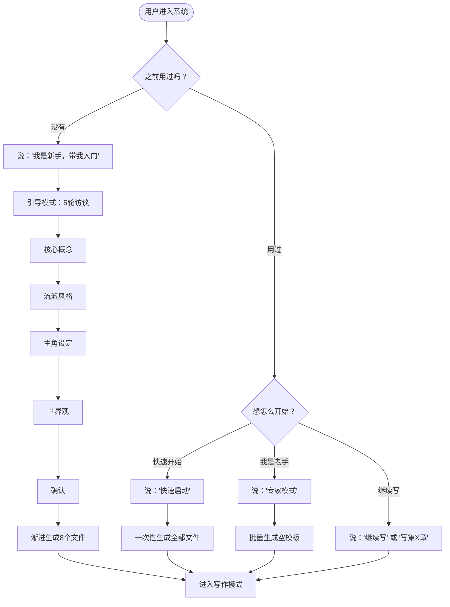
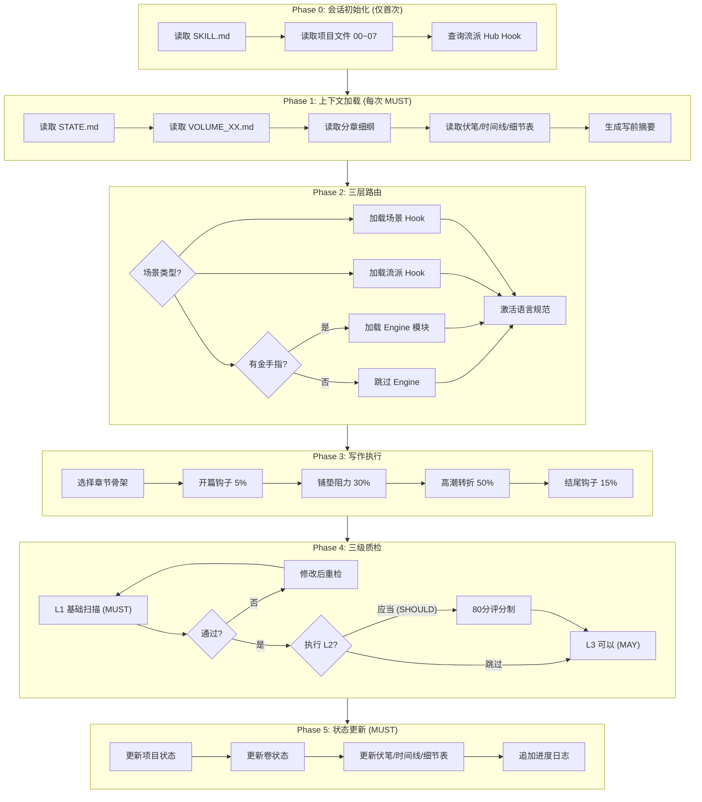
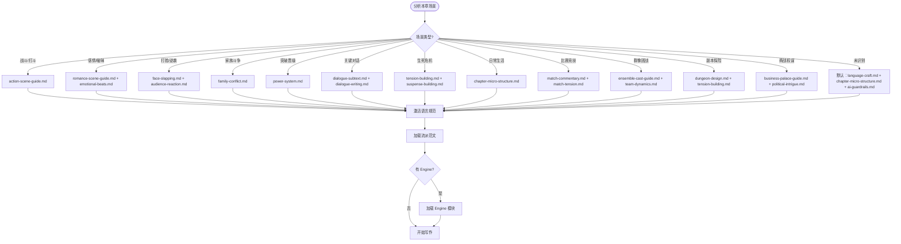
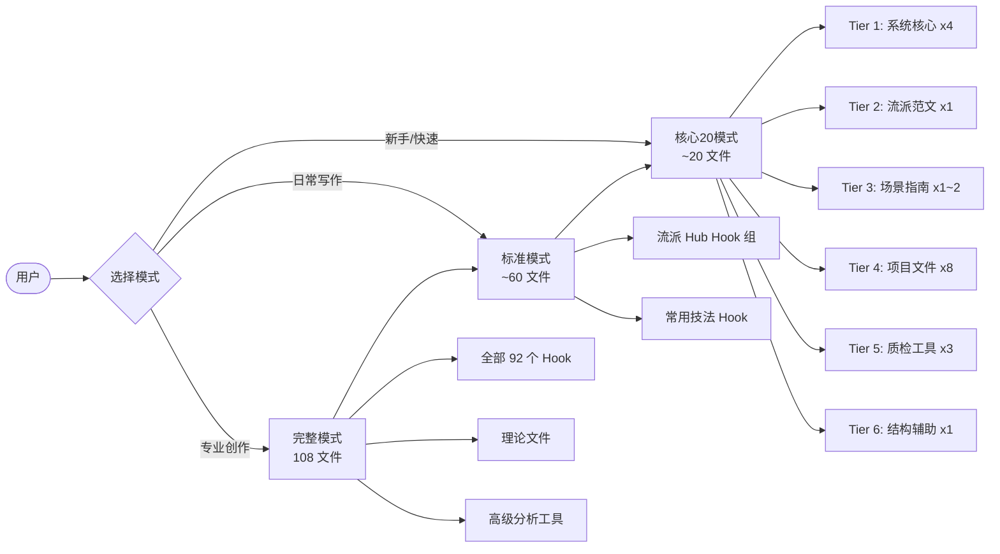

# 视觉流程图 (Visual Process Guide)

> **维护者**：Chinese Novelist Pro Team
> **适用范围**：流程可视化与培训辅助
> **状态**：Active
> **最后校验**：2026-03-01

> **用途**: 用 Mermaid 图表直观展示系统流程
> **渲染**: 支持 Mermaid 的 Markdown 编辑器（VS Code、GitHub、Obsidian 等）

---

## 1. 新手入门决策树

---

## 2. Phase 0-5 执行流程图

---

## 3. 场景路由决策树

---

## 4. 加载模式选择

